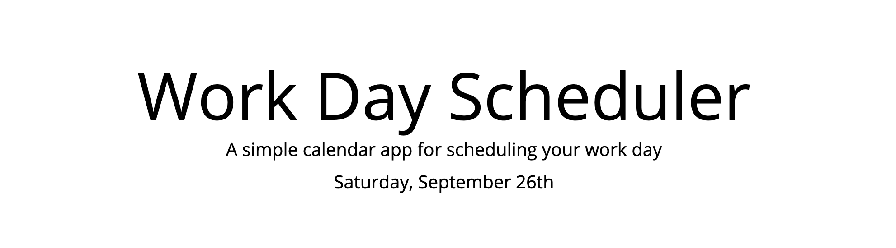

# Scheduler
## Table of contents
* [Prerequisites](https://github.com/brianjunhyuplee/scheduler#prerequisites)
* [Objective](https://github.com/brianjunhyuplee/scheduler#objective)
* [Operation](https://github.com/brianjunhyuplee/scheduler#operation)
* [Process](https://github.com/brianjunhyuplee/scheduler#process)
* [Built-With](https://github.com/brianjunhyuplee/scheduler#built-with)
* [Deployed-Link](https://github.com/brianjunhyuplee/scheduler#deployed-link)
* [Authors](https://github.com/brianjunhyuplee/scheduler#authors)
* [License](https://github.com/brianjunhyuplee/scheduler#license)
* [Acknowledgements](https://github.com/brianjunhyuplee/scheduler#acknowledgments)
## Prerequisites:
* Computer with internet access
## Objective: 

Create a website that keeps track of the current time and date and logs the user's saved schedule to local storage


## Operation:

**To access the website, simply click on this [deploymentlink](https://brianjunhyuplee.github.io/scheduler/).**

1. The top of the website will display the day of the week and date.
2. Each hour has space to input text.
3. Input schedule for each hour.
4. Save each hour by clicking the save button on the right.
5. Refreshing the page will display the previously saved schedule

*This image was taken at 9 pm, every hour that has passed will be displayed in gray, the current hour in red, and the future hours in green*


## Process:
**1.  Edit HTML** 

The given template did not contain the elements for the schedule, just a container. Although it is possible to append these elements through jQuery, for this project, the HTML was edited
*The below code shows how the elements could be appended*

```bash
$(".container").append('
<div class = "row">
        <div class = "col-1" >time</div>
        <div class = "col-10" id = "contentsNumber">
          <textarea id = "inputNumber"></textarea>
        </div>
        <div class = "col-1">
          <button class = "saveBtn" id ="btnNumber">save</button>
        </div>
      </div>)';
```

**2.  Moment.js**

Moment.js keeps track of the current date and time.
*The code below shows how to format to display as shown in the website*
```bash
moment().format('dddd[,] MMMM Do');
```


*The code below shows how to get the current hour*
```bash
moment().hour();
```
By getting the current hour, the code is able to make a comparison between the current time and the hours on the schedule to change each section's background color.
- If the current hour is the same hour as the section, the section will be red.
- If the current hour is passed the hour in the section, the section will be gray.
- If the current hour has not reached the hour in the section, the section will be green.


**3.  Local Storage**

Two main methods were implemented for the local storage.
1. setItem
     ```bash
    $("#btnId").on("click", function() {
    var str = JSON.stringify($("#textAreaId").val());
    localStorage.setItem('keyId',str);
  });
    ```
    - Every time the save button is clicked, the string inputted in the text area is saved.
    - JSON.stringify($("#textAreaId.val()")); turns the inputted value into a string.
    - that string is then put into the local storage under the keyId name.
2. getItem
    ```bash
    if(localStorage.getItem('keyId')!==null){
    $("#textAreaId").text(JSON.parse(localStorage.getItem('keyId')));
    }
    ```
    - Every time the page is refreshed, the string in the local storage under the keyId name will be outputted to the corresponding text area.
    - JSON.parse outputs the actual value into the text area.
        - If parse is not used, the output will have double quotations around the string.

## Built With:
* [HTML](https://developer.mozilla.org/en-US/docs/Web/HTML)
* [CSS](https://developer.mozilla.org/en-US/docs/Web/CSS)
* [JS]([https://developer.mozilla.org/en-US/docs/Web/JavaScript])
* [jQuery](https://developer.mozilla.org/en-US/docs/Glossary/jQuery)

## Deployed Link:
* [scheduler](https://brianjunhyuplee.github.io/scheduler/)

## Author(s):
**Brian Lee**
* [GitHub](https://github.com/brianjunhyuplee)
* [LinkedIn](https://www.linkedin.com/in/brian-lee-559208187/)
* [MyPortfolio :)](https://brianjunhyuplee.github.io/portfolio/)

## License:

This project is licensed under the [MIT-License](https://www.mit.edu/~amini/LICENSE.md)

## Acknowledgments:
* Jerome Chenette (Lead Instructor of UCB Bootcamp)
* Kerwin Hy (TA at UCB Bootcamp)
* Manuel S Nunes (TA at UCB Bootcamp)
* Roger Le (Instructor at UCB Bootcamp)