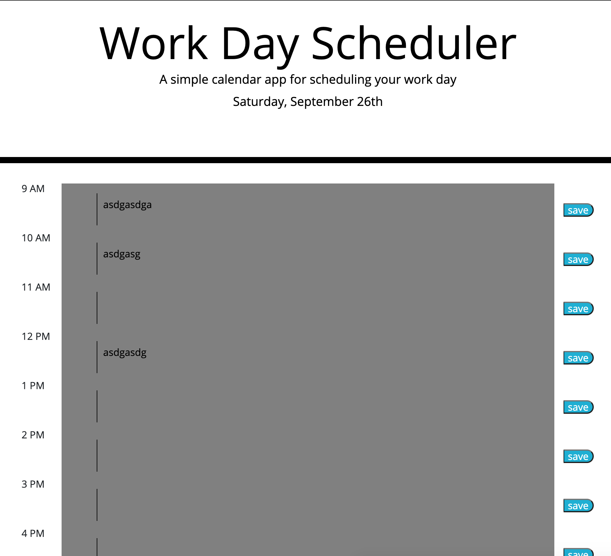

# Scheduler
## Table of contents
* [Prerequisites](https://github.com/brianjunhyuplee/scheduler#prerequisites)
* [Objective](https://github.com/brianjunhyuplee/scheduler#objective)
* [Operation](https://github.com/brianjunhyuplee/scheduler#operation)
* [Process](https://github.com/brianjunhyuplee/scheduler#process)
* [Built-With](https://github.com/brianjunhyuplee/scheduler#built-with)
* [Deployed-Link](https://github.com/brianjunhyuplee/scheduler#deployed-link)
* [Authors](https://github.com/brianjunhyuplee/scheduler#authors)
* [License](https://github.com/brianjunhyuplee/scheduler#license)
* [Acknowledgements](https://github.com/brianjunhyuplee/scheduler#acknowledgments)
## Prerequisites:
* Computer with internet access
## Objective: 

Create a website that keeps track of the current time and date and logs the user's saved schedule to local storage


## Operation:

**To access the website, simply click on this [deploymentlink](https://brianjunhyuplee.github.io/scheduler/).**

1. The top of the website will display the day of the week and date.
2. Each hour has space to input text.
3. Input schedule for each hour.
4. Save each hour by clicking the save button on the right.
5. Refreshing the page will display the previously saved schedule

*This image was taken at 9 pm, every hour that has passed will be displayed in gray, the current hour in red, and the future hours in green*


## Process:
**1.  Edit HTML** 

The given template did not contain the elements for the schedule, just a container. Although it is possible to append these elements through jQuery, for this project, the HTML was edited
*The below code shows how the elements could be appended*

```bash
$(".container").append('
<div class = "row">
        <div class = "col-1" >time</div>
        <div class = "col-10" id = "contentsNumber">
          <textarea id = "inputNumber"></textarea>
        </div>
        <div class = "col-1">
          <button class = "saveBtn" id ="btnNumber">save</button>
        </div>'
      </div>);
```

**2.  Global Variables**

This website needed a large number of global variables as shown below.


*These variables were declared and written in as neeeded*

**3.  Functions**
1. Create a Timer

A timer must be created and displayed. 
The timer will be set to have 60 seconds.
Every time the user click an incorrect answer, subtract 5 from the timer.
When the timer reaches zero or below, the quiz will end.
The timer will begin once the user clicks Begin.


2. Adding Questions and Answers to the HTML

- Arrays for questions, correct answers, and incorrect answers are initialized.

Every time a button is clicked, the next question will be displayed on the HTML using the below code.
```bash
$(#tag).text(questionarray[index]);
```

- After the question is displayed, four answers will be displayed as buttons.

The correct answer will be placed randomly.
The code below shoes the syntax for changing the text of the button.
```bash
$(#button).text(answer[index]);
```
*Every time a question is answered correctly, points will be added.*


3. End of Quiz

Once the user has answered all the questions or run out of time, the system will prompt the user for a name.
The name will be recorded as well as the points into two arrays.
All the buttons used for the quiz will be hidden using the function hide.
The user score will be displayed on the screen as well as a list of previous user names and scores.
Once all values are stored, the point count and index of the question and answer arrays will be set to 0.


4. Try Again

A button labeled Try Again will run the same operations as the Begin button.


## Built With:
* [HTML](https://developer.mozilla.org/en-US/docs/Web/HTML)
* [CSS](https://developer.mozilla.org/en-US/docs/Web/CSS)
* [JS]([https://developer.mozilla.org/en-US/docs/Web/JavaScript])
* [jQuery](https://developer.mozilla.org/en-US/docs/Glossary/jQuery)

## Deployed Link:
* [scheduler](https://brianjunhyuplee.github.io/scheduler/)

## Author(s):
**Brian Lee**
* [GitHub](https://github.com/brianjunhyuplee)
* [LinkedIn](https://www.linkedin.com/in/brian-lee-559208187/)
* [MyPortfolio :)](https://brianjunhyuplee.github.io/portfolio/)

## License:

This project is licensed under the [MIT-License](https://www.mit.edu/~amini/LICENSE.md)

## Acknowledgments:
* Jerome Chenette (Lead Instructor of UCB Bootcamp)
* Kerwin Hy (TA at UCB Bootcamp)
* Manuel S Nunes (TA at UCB Bootcamp)
* Roger Le (Instructor at UCB Bootcamp)